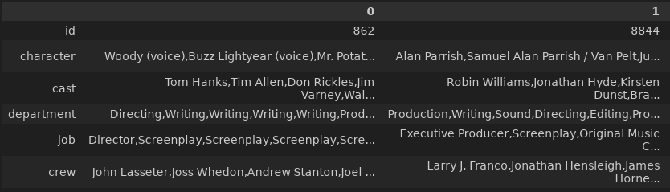

## Table of Contents
1. [Informacion General](#informacion-general)
2. [ETL - Extraction, Transformation and Loading](#etl---extraction-transformation-and-loading) 
    2.1. [Diccionario de Datos movies_dataset](#diccionario-de-datos-movies_dataset) 
    2.2. [Importando datasets: movies_dataset.csv](#1--importando-datasets-movies_datasetcsv) 
    2.3. [Diccionario de Datos credits.csv](#diccionario-de-datos-credits) 
    2.4. [Importando datasets: credits.csv](#1--importando-datasets-creditscsv) 
3. [EDA - Exploratory Data Analysis](#eda---exploratory-data-analysis)
4. [API -  Application Programming Interface](#api---application-programming-interface)
5. [ML -  Machine Learning](#ml---machine-learning)
***
- - -
### Informacion General
### Estudiante: *Luis A, Ramirez G.* 
GitHub: ramirezla 
Email Github: ramirezluisalberto@hotmail.com 
Email usuario Henry: ramirezgluisalberto@gmail.com 

Versiones paquetes utilizados:  
OS: Linux x64 3.10.0-1160.92.1.el7.x8_64 
Visual Studio Code 1.80.1 
Python 3.6.8 
fastapi             0.83.0 
pip                 21.3.1 
matplotlib          3.3.4 
numpy               1.19.5 
pandas              1.1.5 
pip                 21.3.1 
seaborn             0.11.2 
sklearn             0.0.post1 
uvicorn             0.16.0 

Deploy render: 
**https://pi-ml-ops-main-fastapi-linux.onrender.com** 
**https://pi-ml-ops-main-fastapi-linux.onrender.com/docs**

Repositorio Github del proyecto `PI_ML_OPS` 
Usuario: ramirezla 
`git@github.com:ramirezla/PI_ML_OPS-main_fastapi.git`

- - -
# <h1 align=center> **PROYECTO INDIVIDUAL Nº1** </h1>

# <h1 align=center>**`Machine Learning Operations (MLOps)`**</h1>
- - -

- - -

# <h1 align=center> **ETL - Extraction, Transformation and Loading** </h1>

## ETL - Extraction, Transformation and Loading

#### 1.- Informacion general de los datos.

Se trata de entender o hacerse una idea general de los datos, observando las caracteristicas especiales de cada registro del set de datos.

**`Transformaciones`**:

+ Algunos campos, como **`belongs_to_collection`**, **`production_companies`** y otros (ver diccionario de datos) están anidados, esto es o bien tienen un diccionario o una lista como valores en cada fila, ¡deberán desanidarlos para poder  y unirlos al dataset de nuevo hacer alguna de las consultas de la API! O bien buscar la manera de acceder a esos datos sin desanidarlos.

+ Los valores nulos de los campos **`revenue`**, **`budget`** deben ser rellenados por el número **`0`**.
  
+ Los valores nulos del campo **`release date`** deben eliminarse.

+ De haber fechas, deberán tener el formato **`AAAA-mm-dd`**, además deberán crear la columna **`release_year`** donde extraerán el año de la fecha de estreno.

+ Crear la columna con el retorno de inversión, llamada **`return`** con los campos **`revenue`** y **`budget`**, dividiendo estas dos últimas **`revenue / budget`**, cuando no hay datos disponibles para calcularlo, deberá tomar el valor **`0`**.

+ Eliminar las columnas que no serán utilizadas, **`video`**,**`imdb_id`**,**`adult`**,**`original_title`**,**`poster_path`** y **`homepage`**.

 

**`Archivos con los datos`**:

+ [credits.csv](./Datasets/credits.csv)
+ [movies_dataset.csv](./Datasets/movies_dataset.csv)

#### Diccionario de Datos movies_dataset:

| Característica | Descripción |
| --------- | --------- |
| adult	| Indica si la película tiene califiación X, exclusiva para adultos. |
| belongs_to_collection	| Un diccionario que indica a que franquicia o serie de películas pertenece la película |
| budget | El presupuesto de la película, en dólares |
| genres | Un diccionario que indica todos los géneros asociados a la película |
| homepage | La página web oficial de la película |
| id | ID de la pelicula |
| imdb_id | IMDB ID de la pelicula |
| original_language	| Idioma original en la que se grabo la pelicula |
| original_title | Titulo original de la pelicula |
| overview | Pequeño resumen de la película |
| popularity | Puntaje de popularidad de la película, asignado por TMDB (TheMoviesDataBase) |
| poster_path | URL del póster de la película |
| production_companies | Lista con las compañias productoras asociadas a la película |
| production_countries | Lista con los países donde se produjo la película |
| release_date | Fecha de estreno de la película |
| revenue | Recaudación de la pelicula, en dolares |
| runtime | Duración de la película, en minutos |
| spoken_languages | Lista con los idiomas que se hablan en la pelicula |
| status | Estado de la pelicula actual (si fue anunciada, si ya se estreno, etc) |
| tagline | Frase celebre asociadaa la pelicula |
| title | Titulo de la pelicula |
| video | Indica si hay o no un trailer en video disponible en TMDB |
| vote_average | Puntaje promedio de reseñas de la pelicula |
| vote_count | Numeros de votos recibidos por la pelicula, en TMDB |

#### Diccionario de Datos credits:

- Cast and Crew 

| - - - | `Cast` | - - - |
| --------- | --------- | --------- |
| `Característica` | `Descripción` | `Util` |
| cast_id	| id del personaje | No |
| character	| Nombre del personaje | Si |
| credit_id | id de los creditos | No |
| gender | Genero | No |
| id | id del Actor | No |
| name | Nombre del actor | Si |
| order |  | No |
| profile_path | Curriculum del actor | No |
| - - - | `Crew` | - - - |
| `Característica` | `Descripción` | `Util` |
| credit_id	| id de los creditos | No |
| department | Nombre del departamento: Directing, Sound, Writing, Camera, Production | Si |
| gender | Genero | No |
| id | id del cargo | No |
| job | Nombre del cargo: Director, Original Music Composer, Screenplay, Director of Photography, Producer, Executive Producer, Writer, Costume Design, Casting | Si |
| name | Nombre del trabajor | Si |
| profile_path | Curriculum del trabajador | No |
- - -
#### Librerias

Se importan las librerias necesarias para realizar la limpieza de los datos.

- Libreria para importar y manipular los datos:  
**`import pandas as pd`**  
**`import numpy as np`**  
**`import ast`**  
**`import math`**  

- Librerias para graficar y entender las caracteristicas y comportamiento de los datos:  
**`import matplotlib.pyplot as plt`**  
**`import seaborn as sns`**

- Librerias para el modelamiento de los datos:  
**`from wordcloud import WordCloud`**  
**`from sklearn.metrics.pairwise import cosine_similarity`**  
**`from sklearn.feature_extraction.text import CountVectorizer`**  
**`from textblob import TextBlob`**  
**`import nltk`**  
- - -
#### 1.- Importando datasets: movies_dataset.csv

Se trata de entender o hacerse una idea general de los datos, observando las caracteristicas especiales de cada registro del set de datos.

**`Información visual del set de datos:`**

- Se tiene un total de 45466 filas y 24 columnas
- budget: Se muestra como typo objeto y es numerico ya que almacena el presupuesto de la película, en dólares.
Se colocara el valor de 0 (cero) para los datos faltantes, nulos o vacios.
- Se tienen columnas con una significativa cantidad de datos faltantes, nulos o vacios.
    - belongs_to_collection
    - homepage
    - tagline
- Se tienen datos que estan compuestos por un diccionario o por una lista de diccionarios, estos datos deben ser separados para su facil manipulacion:
    - belongs_to_collection: Indica a que franquicia o serie de películas pertenece la película.
    - genres: Un diccionario que indica todos los géneros asociados a la película.
    - production_companies: Lista con las compañias productoras asociadas a la película.
    - production_countries: Lista con los países donde se produjo la película.
    - spoken_languages: Lista con los idiomas que se hablan en la pelicula.
    - - -

    2.- **`Transformaciones`**.
    **`Trabajando con los Datos Numéricos`**.

- budget
- revenue
- runtime
- vote_average
- vote_count

**budget**

Se verifica la columna 'budget, ya que debe tener un valor no mumérico. 
Cambiar el tipo de dato de cadena a numérico en el campo budget 
Se tienen datos como: "/ff9qCepilowshEtG2GYWwzt2bs4.jpg" 

Se tiene todos los datos numericos iniciales en tipos numericos (float54):

- budget
- revenue
- runtime
- vote_average
- vote_count

Cuando la std muestra que es diferente de 0, indica que tiene valores diferentes, entonces pareciera que esta bien.

**`Trabajando con los Datos Categóricos`**.

**Datos tipo diccionario y listas**.

- belongs_to_collection: Diccionario que indica a que franquicia o serie de películas pertenece la película. 
- genres: Diccionario que indica todos los géneros asociados a la película. 
- production_companies: Lista con las compañias productoras asociadas a la película. 
- production_countries: Lista con los países donde se produjo la película. 
- spoken_languages: Lista con los idiomas que se hablan en la pelicula. 

Conteo de los niveles en las diferentes columnas categoricas para las que se tienen idea, por ejemplo: si es sexo deberia tener 2 categorias hombre o mujer (por ahora).
si es estado civil puede haber soltero, casado, divorciado, otros, etc.
Con esto podemos determinar si alguna tiene una sola cetegoria, entonces, esta columna no aportara nada.

Si se desea en algunos datos categoricos que si tenemos idea de cuantas categorias deberia traer.
columnas = ['adult', 'genres', 'original_language', 'spoken_languages', 'status', 'video']

Columna adult: 5 subniveles 
Columna belongs_to_collection: 1699 subniveles 
Columna genres: 4069 subniveles 
Columna homepage: 7674 subniveles 
Columna id: 45436 subniveles 
Columna imdb_id: 45418 subniveles 
Columna original_language: 93 subniveles 
Columna original_title: 43373 subniveles 
Columna overview: 44308 subniveles 
Columna popularity: 44177 subniveles 
Columna poster_path: 45025 subniveles 
Columna production_companies: 22709 subniveles 
Columna production_countries: 2394 subniveles 
Columna release_date: 17337 subniveles 
Columna spoken_languages: 1932 subniveles 
Columna status: 7 subniveles 
Columna tagline: 20284 subniveles 
Columna title: 42278 subniveles 
Columna video: 3 subniveles 
 

Graficando algunos campos y sus categorias

Se puede observar que la columna 'adult' ademas de que la mayor cantidad es 'false', y no aporta nada, los otros datos son errores, es candidata a ser eliminada la columna 'adult

- - -

Mediante el analisis visual se presentan columnas con datos formados por diccionarios y listas de diccionarios, este tipo de información se encuentra anidada o agrupada, y la información principal se encuentra en la clave 'name', 'character', 'department', 'job', por lo que, es necesario obtener el valor que viene en la clave principal que se desea.
Se crean algunas funciones que exploran y extraen el valor de la clave, tanto para datos tipos diccionarios como listas de diccionarios.

- `1.- def Valor_name_desde_dicc(value):`, esta funcion recibe (mediante aplicacion) el dataframe y la columna diccionario, retorna el valor de la clave `'name'`, o una cadena vacia si no cumple con la caracteristica de diccionario de python..
- `2.- def Valor_name_desde_list(value):`, esta funcion recibe (mediante aplicacion) el dataframe y la columna lista de diccionario, retorna el valor de la clave `'name'` o una cadena vacia si no cumple con la caracteristica de lista de diccionario.
- `3.- def Valor_character_desde_list(value):`, esta funcion recibe (mediante aplicacion) el dataframe y la columna lista de diccionario, retorna el valor de la clave `'character'` o una cadena vacia si no cumple con la caracteristica de lista de diccionario.
- `4.- Valor_department_desde_list(value):`, esta funcion recibe (mediante aplicacion) el dataframe y la columna lista de diccionario, retorna el valor de la clave `'department'` o una cadena vacia si no cumple con la caracteristica de lista de diccionario.
- `5.- def Valor_job_desde_list(value):`, esta funcion recibe (mediante aplicacion) el dataframe y la columna lista de diccionario, retorna el valor de la clave `'job'` o una cadena vacia si no cumple con la caracteristica de lista de diccionario.

**`Trabajando con calculo de inversion`**.

**return = revenue / budget**

Característica
Crear la columna con el retorno de inversión, llamada return con los campos revenue y budget, 
dividiendo estas dos últimas revenue / budget, cuando no hay datos disponibles para calcularlo, deberá tomar el valor 0
Es importante saber si el divisor 'revenue' tiene valores 0, ya que no existe la division por 0
Se crea una fumcion lambda, donde retorna 0 si budget es 0, de lo contrario, retorna la division de revenue / budget y crea la columna 'return'

**`df_movies_desanidado['return'] = df_movies_desanidado.apply(lambda x_return: 0 if x_return['budget'] == 0 else (x_return['revenue'] / x_return['budget']), axis=1)`**

| revenue | budget | return |
| --------- | --------- | --------- |
| 373554033.0 | 30000000.0 | 12.451801 |
| 0.0 | 0.0 | 0.000000 |
| 262797249.0 | 65000000.0 | 4.043035 |
| 81452156.0 | 16000000.0 | 5.090760 |
| 76578911.0 | 0.0 | 0.000000 |

**`Trabajando con los datos de tipo fechas`**.

Para evitar problemas con este tipo de campo se tiene que verificar que realmentes sea de tipo fecha y en un formato manejable como puede ser: 'AAAA-mm-dd', debido a la importancia del valor no es conveniente tener campos con valores nulos o faltantes.
En nuestro caso de estudio se creará otra columna con el año de la fecha para su facil acceso, este campo será de tipo int64 (sin decimale)

**`Eliminando columnas`**.

**video, imdb_id, adult, original_title, poster_path y homepage**

La columna 'tagline' es elegible a ser borrada

print('Total de datos del campo tagline: ', len(df_movies_DEs['tagline']))
print('Cantidad de valores nulos del campo tagline: ', df_movies_DEs['tagline'].isnull().sum())
print('Porcentaje de datos nulos: ', round(df_movies_DEs['tagline'].isnull().sum() / (len(df_movies_DEs['tagline'])) * 100, 2),'%')

Total de datos del campo tagline:  45376 
Cantidad de valores nulos del campo tagline:  24978 
Porcentaje de datos nulos:  55.05 %
- - -
#### 1.- Importando datasets: credits.csv.

**`Información visual del set de datos:`**

- Se tiene un total de 45476 filas y 3 columnas
- cast: Se muestra como typo objeto.
- crew: Se muestra como typo objeto.
- id: Se muestra como typo int64
Se colocara el valor de 0 (cero) para los datos faltantes, nulos o vacios.
- No se tienen columnas con datos faltantes, nulos o vacios.
- Se tienen datos que estan compuestos por una lista de diccionarios, estos datos deben ser separados para su facil manipulacion:
    - cast: 
    - crew: 

Mediante el analisis visual se presentan columnas con datos formados por diccionarios y listas de diccionarios, este tipo de información se encuentra anidada o agrupada, y la información principal se encuentra en la clave 'character', 'department', 'job', por lo que, es necesario obtener el valor que viene en la clave principal que se desea.

La información que se requiere para el campo 'cast': 
    - 'character' 
    - 'cast' 

La información que se requiere para el campo 'crew': 
    - 'department' 
    - 'job' 
    - 'name' 

Se reutiliza ajustando la funcion: Valor_department_desde_list y Valor_job_desde_list, esta funcion recibe (mediante aplicacion) el dataframe y la columna lista de diccionario, retorna el valor de la clave 'department', 'job' y 'name' o una cadena vacia si no cumple con la caracteristica de lista de diccionario.

- Cast (elenco) 

- Crew (equipo) 

- - -

- - -

# <h1 align=center> **EDA - Exploratory Data Analysis** </h1>

## EDA - Exploratory Data Analysis

**`Análisis exploratorio de los datos`**

+ Se investiga las relaciones que hay entre las variables de los datasets y si hay outliers o anomalías (no neceariamente son errores, por lo que pueden llegar a ser necesarios para el amalisis)
+ Se investiga si hay algún patrón que nos ayude en el análisis.
+ Para el caso de recomendacion de peliculas las nubes de palabras dan una buena idea de cuáles palabras son más frecuentes en los títulos.

Se trabaja con el dataset limpio en la parte del ETL: "./Datasets/LARG_moviesdataset_reducido.csv"

<class 'pandas.core.frame.DataFrame'> 
RangeIndex: 17176 entries, 0 to 17175 
Data columns (total 26 columns): 
| Column | Non-Null | Count | Dtype |
| --- | ------ | -------------- | ----- |
| 0 | Unnamed: 0 | 17176 non-null | int64 |
| 1 | id         | 17176 non-null | int64 |
| 2 | title      | 17176 non-null | object |
| 3 | genres     | 17176 non-null | object |
| 4 | overview   | 17176 non-null | object |
| 5 | budget     | 17176 non-null | float64 |
| 6 | spoken_languages | 17176 non-null | object |
| 7 | original_language| 17176 non-null | object |
| 8 | belongs_to_collection | 2392 non-null | object |
| 9 | production_companies | 17176 non-null | object |
| 10 | production_countries | 17176 non-null | object |
| 11 | status               | 17176 non-null | object |
| 12 | release_date         | 17176 non-null | object |
| 13 | release_year         | 17176 non-null | int64 |
| 14 | runtime              | 17176 non-null | float64 |
| 15 | popularity           | 17176 non-null | float64 |
| 16 | vote_count           | 17176 non-null | float64 |
| 17 | vote_average         | 17176 non-null | float64 |
| 18 | revenue              | 17176 non-null | float64 |
| 19 | return               | 17176 non-null | float64 |
| . | . | .| |
| 24 | job                  | 17176 non-null | object |
| 25 | crew                 | 17176 non-null | object |

dtypes: float64(7), int64(3), object(16) 
memory usage: 3.4+ MB 

Se observa que se tienen 17.176 registros (filas) y 26 datos (columnas) de información.
Tambien se ve que el campo 'belongs_to_collection' solo tiene 2392 datos no nulos del total de 17.176.
A simple vista es notable que este campo es candidato a ser borrado, pero por su información que contiene, es muy util al momento de recomendar una pelicula.

Se puede hacer una descripcion de los datos tipos numéricos.

Cuando la std muestra que es diferente de 0, indica que tiene valores diferentes, entonces pareciera que esta bien.

**`Detectando outlies o valores extremos`**

Conteo de los niveles en las diferentes columnas categoricas para las que se tienen idea, por ejemplo: si es sexo deberia tener 2 categorias hombre o mujer (por ahora).
si es estado civil puede haber soltero, casado, divorciado, otros, etc.
Con esto podemos determinar si alguna tiene una sola cetegoria, entonces, nos indicaria que esta columna no aporta nada.

| Columna | Cantidad categorias o subniveles |
| ------- | ------- |
| Columna id: | 17169 subniveles | 
| Columna title: | 16421 subniveles |
| Columna genres: | 2544 subniveles |
| Columna overview: | 17164 subniveles |
| Columna budget: | 800 subniveles |
| Columna spoken_languages: | 984 subniveles |
| Columna original_language: | 56 subniveles |
| Columna belongs_to_collection: | 1090 subniveles |
| Columna production_companies: | 12118 subniveles |
| Columna production_countries: | 1076 subniveles |
| Columna status: | 5 subniveles |
| Columna release_date: | 10149 subniveles |
| Columna release_year: | 107 subniveles |
| Columna runtime: | 236 subniveles |
| Columna popularity: | 17089 subniveles |
| Columna vote_count: | 1790 subniveles |
| Columna vote_average: | 88 subniveles |
| Columna revenue: | 5428 subniveles |
| Columna return: | 4455 subniveles |
| Columna tagline: | 17082 subniveles |
| Columna character: | 16977 subniveles |
| Columna cast: | 17161 subniveles |
| Columna department: | 12820 subniveles |
| Columna job: | 13854 subniveles |
| Columna crew: | 17101 subniveles |

#### Realizando un diagrama BoxPlot 
El Diagrama de Caja y bigotes (box and whisker plot en inglés) es un tipo de gráfico que muestra un resumen de una gran cantidad de datos en cinco medidas descriptivas, además de intuir su morfología y simetría. Este tipo de gráficos nos permiten visualizar y comparar la distribución y la tendencia central de valores numéricos mediante sus cuartiles.

Verificar si hay outlies o valores extremos, se debe decidir si se eliminan o se mantienen, eso depende de lo que deseamos.
Se realiza un grafico tipo boxplot de las variables numericas, en él podemos ver 

Observando la matrix de correlacion.

Se realiza un grafico de barras mostrando la cantidad de generos por peliculas, solo para observar que la mayor cantidad de peliculas creadas entre 1896 al 2017 han sido las de Drama.

- - -

- - -

# <h1 align=center> **API -  Application Programming Interface** </h1>

## API -  Application Programming Interface

Las API son mecanismos que permiten a dos componentes de software comunicarse entre sí mediante un conjunto de definiciones y protocolos. Por ejemplo, el sistema de software del instituto de meteorología contiene datos meteorológicos diarios. La aplicación meteorológica de su teléfono “habla” con este sistema a través de las API y le muestra las actualizaciones meteorológicas diarias en su teléfono. 

Aunque existen varios tipos de API, para nuestro caso se utilizara API de Rest. 

Las API de Rest consiste en que El cliente envía las solicitudes al servidor como datos. El servidor utiliza esta entrada del cliente para iniciar funciones internas y devuelve los datos de salida al cliente. 

Debido a que se dispone un servidor API gratis en render y éste solo puede cargar 512 Mb de memoria, se reduce el datasets para permitir que no ocupe toda la memoria gratis. 

Acceso via url del deploy: 
**https://pi-ml-ops-main-fastapi-linux.onrender.com** 

`Se probaron las siguientes opciones para reducir el datasets` 

    . Se quitaron todos los valores nulos que contiene el campo: belongs_to_collection
        Index: 2392
        Data columns (total 25 columns)
        LARG_moviesdataset_reducido.dropna(inplace=True)

    . Se utilizó un dataframe, reduciendo el 60% de las filas de forma aleatoria
        Index: 10306
        Data columns (total 25 columns)
        LARG_moviesdataset_reducido = LARG_moviesdataset_reducido.sample(frac=0.6, replace=True)

    . Se utilizó un dataframe, reduciendo el 50% de las filas de forma aleatoria pero solo de las filas que tienen NaN en la columna belongs_to_collection
        a.- Se crea una mascara boolenan con las filas que tienen NaN en la columna belongs_to_collection
            Mask_LARG_moviesdataset_reducido = LARG_moviesdataset_reducido['belongs_to_collection'].isna()
            
        b.- Aplico el sample, pero colocando el peso de la mascara
            LARG_moviesdataset_reducido = LARG_moviesdataset_reducido.sample(frac=0.6, weights=Mask_LARG_moviesdataset_reducido)

`Para continuidad del ejercicio se trabaja con los datos del dataset "./Datasets/LARG_moviesdataset_reducido_ml_sample_60.csv" 
Para esto se utilizo la funcion sample() con frac=0.6, con esto se le indica que deje el 60% de los datos del dataset y el 40% sea eliminado de forma aleatoria.`

Se crea un ambiente virtual para encapsular lo necesario para las API y de este modo hacer el deploy en render lo mas limpio posible.

Archivos y directoios importantes para realizar el deploy en render:

    . 'requirements.txt' Archivo que le indica a la plataforma render las librerias y las versiones que se necesitan instalar.
    . 'Datasets' Directorio que contiene los archivos .csv con los datos a utilizar por las APIs.
    . 'main.py' Archivo principal que contendra las APIS, su configuracion de librerias.

Archivos y directorios no importantes para el deploy por lo que se ignoran al momento de actualizar el github

    . '.gitignore' Archivo que le indica al github que al momento de hacer un 'git add .' los ignore, por lo que al hacer el push no sera subido al repositorio.
    . 'env' Directorio donde se guarda la configuracion del ambiente virtual creado localmente, este directorio sera ignorado y no sera subido al repositorio.

`Contenido de los archivos:` 

- `requirements.txt` 
    fastapi==0.93.0 
    pandas==1.3.5 
    pip==23.2.1 
    typing-extensions==4.5.0 
    uvicorn==0.20.0 
    wordcloud==1.9.2 
    scikit-learn==1.0.2 

- `main.py` 
    - 1.- Cantidad de peliculas según el idioma.
        - Nombre de la API: `def peliculas_idioma(Idioma: str)`
        - Datos de entrada: Se ingresa un idioma (como están escritos en el dataset, sin traducirlos), tipo string. 
            - Ejemplo: `es` -> Español | `en` -> Inglés | `fr` -> Frances
        - Uso: `https://.../peliculas_idioma/{es}`
        - Informacion que retorna: Debe devolver la cantidad de películas producidas en ese idioma. 
            - Ejemplo: `{'Idioma indicado': 'en', 'Cantidad encontrada': 9040}`
          
    - 2.- Tiempo de duracion y año de la pelicula.
        - Nombre de la API: `def pelicula_duracion_anno(pelicula: str)`
        - Datos de entrada: Se ingresa una pelicula, tipo string.
            - Ejemplo: `Toy Story, Jumanji, Grumpier Old Men, Waiting to Exhale, Father of the Bride Part II`
        - Uso: `https://.../pelicula_duracion_anno/{Jumanji}`
        - Informacion que retorna: Debe devolver el tiempo de duracion y el año de la pelicula.
            - Ejemplo: `{'Nombre Pelicula': 'Jumanji', 'Duracion en minutos': 8183, 'Año de estreno': 8183}`
          
    - 3.- Cantidad de peliculas producidas, la ganancia y el promedio por franquicia.
        - Nombre de la API: `def franquicia_cant_gana_prom_peliculas(franquicia: str)`
        - Datos de entrada: Se ingresa la franquicia, tipo string.
            - Ejemplo: `James Bond, Toy Story, Living Dead, A Nightmare on Elm Street, Beverly Hills Chihuahua`
        - Uso: `https://.../franquicia_cant_gana_prom_peliculas/{Living Dead}`
        - Informacion que retorna: Debe devolver la cantidad de peliculas, ganancia total y promedio por la franquicia.
            - Ejemplo: `{'Titulo franquicia': 'Living Dead', 'Cantidad peliculas': 10, 'Ganancia Total': 260364858.0, 'Promedio ganancia': 26036485.8}`
           
    - 4.- Cantidad de peliculas por pais.
        - Nombre de la API: `def peliculas_pais(pais: str)`
        - Datos de entrada: Se ingresa un país (como están escritos en el dataset, sin traducirlo), tipo string.
            - Ejemplo: `United States of America, Canada, Spain, China,	Russia, Germany, Australia, United Kingdom`
        - Uso: `https://.../peliculas_pais/{United Kingdom}`
        - Informacion que retorna: Retorna la cantidad de peliculas producidas en pais.
            - Ejemplo: `{'Titulo franquicia': 'Living Dead', 'Cantidad peliculas': 10, 'Ganancia Total': 260364858.0, 'Promedio ganancia': 26036485.8}`
           
    - 5.- Cantidad de peliculas producida por productora.
        - Nombre de la API: `def productoras_exitosas(productora: str)`
        - Datos de entrada: Se ingresa la productora, tipo string.
            - Ejemplo: `Paramount Pictures,	Laurel Group, Gran Via Productions, Metro-Goldwyn-Mayer (MGM), Safir Films, Walt Disney Pictures, Republic Pictures, Warner Bros., Rysher Entertainment, Marvista Entertainment, Feifer Worldwide`
        - Uso: `https://.../productoras_exitosas/{United Kingdom}`
        - Informacion que retorna: Retorna el total y la cantidad de peliculas que realizo..
            - Ejemplo: `{'Productora': 'Walt Disney Pictures', 'Total ingresos': 3367407539.0, 'Cantidad de peliculas': 38}`
           
    - 6.- Cantidad de peliculas producida por productora.
        - Nombre de la API: `def get_director(director: str)`
        - Datos de entrada: Se ingresa el nombre de un director, tipo string.
            - Ejemplo: `Forest Whitaker, John Lasseter, Howard Deutch`
        - Uso: `https://.../get_director/{Howard Deutch}`
        - Informacion que retorna: Retorna el éxito del mismo medido a través del retorno, demás, deberá devolver el nombre de cada película con la fecha de lanzamiento, retorno individual, costo y ganancia de la misma, en formato lista.
            - Ejemplo: `[['Howard Deutch', 'The Replacements', '2000-08-07', 0.0, 0.0, 0.0], ['Howard Deutch', 'The Replacements', '2000-08-07', 0.0, 0.0, 0.0], ['Howard Deutch', 'The Whole Ten Yards', '2004-04-07', 0.65, 40000000.0, 26155781.0]]`

- - -

- - -

# <h1 align=center> **ML -  Machine Learning** </h1>

## ML -  Machine Learning

**`Modelo de evaluacion 1`**

wordcloud - Nubes de palabras

Las nubes de palabras o nubes de etiquetas son representaciones gráficas de la frecuencia de las palabras que otorgan mayor protagonismo a las palabras que aparecen con mayor frecuencia en un texto de origen. 
Se utiliza el dataset: `"./Datasets/LARG_moviesdataset_reducido_ml_sample_60.csv"`

#### Caso 1 recomendacion
Utilizando 60% de los datos y las columnas:  
`belongs_to_collection, popularity, vote_average, budget, revenue`

Se preparan el set de datos con variables categóricas y numéricas con los datos que se consideraron relevantes pata este caso: 
. categóricas
    . belongs_to_collection 
. numéricas
    . popularity 
    . vote_average 
    . budget 
    . revenue 

- Se concatenan en una sola variable de tipo string y se crea una nueva columna en el dataset llamada: 'columnas_concatenadas' 
- Con la columna concatenada 'columnas_concatenadas' se crea un vector para realizar el calculo de similitud. 
- Se utiliza `CountVectorizer()` de la libreria sklearn esto permitira crear una matriz de cantidad de cada tokens. 
- Se obtiene el indice del dataset ubicando el campo 'title'
- cosine_sim
- Se ordena por scores similares
- Retornando los 5 primeros elementos, los cuales seran las peliculas recomendadas.

Ejemplo: 
url: `https://pi-ml-ops-main-fastapi-linux.onrender.com/get_recomendacion/Alone%20in%20the%20Dark` 
[ 
"Georgia Rule", 
"Kazaam", 
"Hands of Stone", 
"The Last Kiss", 
"Steamboy" 
]

#### Caso 2 recomendacion
Utilizando 60% de los datos y las columnas:  
`belongs_to_collection, popularity, genres, cast, vote_count`

Se preparan el set de datos con variables categóricas y numéricas con los datos que se consideraron relevantes pata este caso: 
. categóricas
    . belongs_to_collection 
    . genres 
    . cast 
. numéricas
    . popularity 
    . vote_count 

- Se concatenan en una sola variable de tipo string y se crea una nueva columna en el dataset llamada: 'columnas_concatenadas' 
- Con la columna concatenada 'columnas_concatenadas' se crea un vector para realizar el calculo de similitud. 
- Se utiliza `CountVectorizer()` de la libreria sklearn esto permitira crear una matriz de cantidad de cada tokens. 
- Se obtiene el indice del dataset ubicando el campo 'title'
- cosine_sim
- Se ordena por scores similares
- Retornando los 5 primeros elementos, los cuales seran las peliculas recomendadas.

Ejemplo: 
url: `https://pi-ml-ops-main-fastapi-linux.onrender.com/get_recomendacion/Alone%20in%20the%20Dark` 
[ 
"Georgia Rule", 
"Kazaam", 
"Hands of Stone", 
"The Last Kiss", 
"Steamboy" 
]